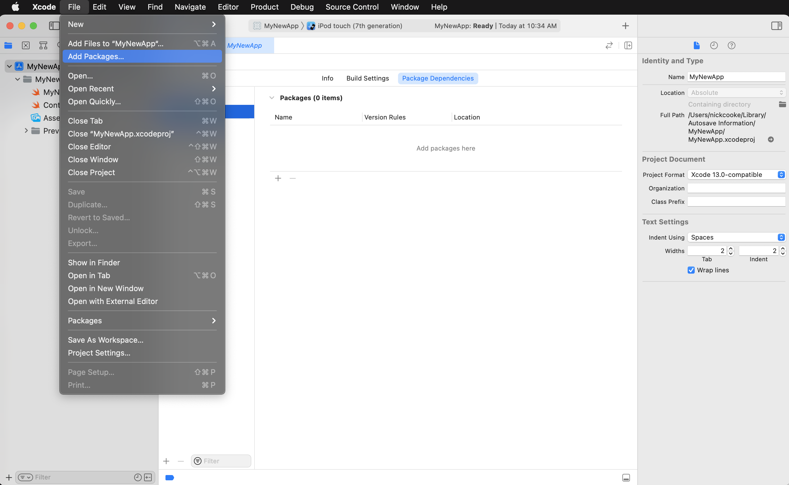
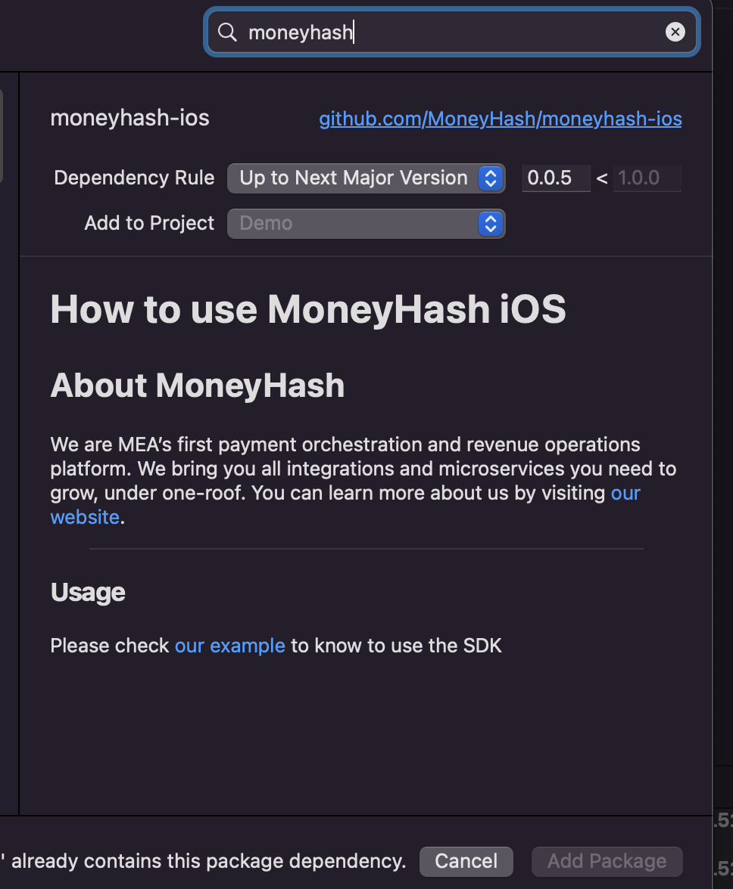

# How to use MoneyHash iOS

## About MoneyHash

We are MEA’s first payment orchestration and revenue operations platform. We bring you all integrations and microservices you need to grow, under one-roof.
You can learn more about us by visiting [our website](https://www.moneyhash.io/).

## Requirements

- Requires Xcode 12.5 or above

## Installation

Add a package by selecting `File` → `Add Packages…` in Xcode’s menu bar.



---

Search for the MoneyHash SDK using the repo's URL:
```console
https://github.com/MoneyHash/moneyhash-ios
```

Next, set the **Dependency Rule** to be `Up to Next Major Version` and specify `0.0.3` as the lower bound.

Then, select **Add Package**.



---

### Usage

To start the payment flow you need to get the payment id from your backend and send it as paramter with the enviorment (staging or production) and then start the flow

1- import MoneyHash to your view controller
```swift
import MoneyHash
```

2- 

```swift
        DispatchQueue.main.async {
            MHPaymentHandler.start(
                on: self,
                withPaymentId: "Your payment id will be here",
                andEnvironment: .staging
            ) { status in
                switch status {
                case .error(errors: let errors):
                    print("errors")
                case .failed:
                    print("faild")
                case .requireExtraAction(actions: let actions):
                    print("actions")
                case .success:
                    print("success")
                case .cancelled:
                    print("cancelled")
                case .unknown:
                    print("unknown")
                @unknown default:
                    print("unknown")
                }
            }
        }
```

## Questions and Issues

Please provide any feedback via a [GitHub Issue](https://github.com/MoneyHash/moneyhash-ios/issues/new?template=bug_report.md).
