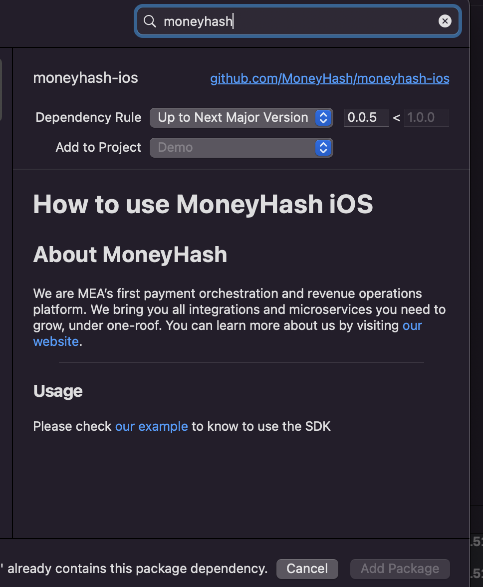

# How to use MoneyHash iOS

### Requirements

- Requires Xcode 14.3 or above


## Migration Guide

If you're upgrading to version 2 of the MoneyHash SDK, please refer to the [Migration Guide to V2](./MIGRATION_TO_V2.md) for detailed instructions.


## Installation

Add a package by selecting `File` → `Add Packages…` in Xcode’s menu bar.


---

Search for the MoneyHash SDK using the repo's URL:
```console
https://github.com/MoneyHash/moneyhash-ios
```

Next, set the **Dependency Rule** to be `Up to Next Major Version` and specify `1.0.6` as the lower bound.

Then, select **Add Package**.



---

## How to use?

- Create moneyHash instance using `MoneyHashSDKBuilder`

```swift
import MoneyHash

let moneyHashSDK = MoneyHashSDKBuilder.build()
```

> MoneyHash SDK guides you through the actions required for seamless integration using intent details `state`.

| State                             | Action                                                                                                                                                                                                                   |
| :-------------------------------- | :------------------------------------------------------------------------------------------------------------------------------------------------------------------------------------------------------------------------|
| `methodSelection`                 | Has an associated variable `methods` of type `IntentMethods` (optional) containing information about all available methods for the intent. Use this to render them natively with your own styles. <br> and use `moneyHash.proceedWithMethod` to proceed with one of them on user selection. |
| `intentForm`                      | Use `moneyHash.renderForm` to start the SDK flow and let MoneyHash handle the process for you.                                                                                                                             |
| `intentProcessed`                 | Render your successful confirmation UI with the intent details.                                                                                                                                                           |
| `transactionFailed`               | Has an optional associated variable `recommendedMethods` of type `IntentMethods`, containing some recommended methods to present to the user if the transaction fails.                                                     |
| `transactionWaitingUserAction`    | Render your pending actions confirmation UI with the intent details & `externalActionMessage` if it exists on `Transaction`.                                                                                                |
| `expired`                         | Render your intent expired UI.                                                                                                                                                                                             |
| `closed`                          | Render your intent closed UI.                                                                                                                                                                                              |
| `formFields`                      | Has associated variables `cardEmbed` of type optional `CardEmbed` (containing information about the card form to render), `billingFields` of type optional array of `InputField` (containing information about the required billing fields to render), and `shippingFields` of type optional array of `InputField` (containing information about the required shipping fields to render). <br> Use this information to build and render the form. |
| `redirectToURL`                   | Use `moneyHash.renderForm` to start the SDK flow, handle redirection, and let MoneyHash handle the process for you.result.                                                                                  |
| `savedCardCVV`                    | Has associated variables `cvvField` of type `InputField` (containing information about the CVV field) and `cardTokenData` of type `CardTokenData` (containing information about the saved card).                            |


### Get Intent Details

Retrieve details about a specific intent using its ID and type (Payment/Payout).

```swift
    do {
        let intentDetails = try await self.moneyHashSDK.getIntentDetails(
            intentId: "Z1ED7zZ",
            intentType: .payment
        )
        print(try intentDetails.convertToDictionary())
        // handle the updated intent details and methods
    } catch {
        print("Error: \(error)")
    }
```

### Get Available Payment/Payout Methods

Fetch the available payment/payout methods, saved cards, and customer balances for a specific intent.

```swift
do {
    let intentMethods = try await self.moneyHashSDK.getIntentMethods(
        intentId: "Z1ED7zZ",
        intentType: .payment
    )
    print(try intentMethods.convertToDictionary())
    // handle the updated intent details and methods
} catch {
    print("Error: \(error)")
}
```


### Proceed with a Payment/Payout Method

Proceed with a selected payment/payout method, card, or wallet for an intent.

```swift
do {
    let methodsResult = try await self.moneyHashSDK.proceedWithMethod(
        intentId: "Z1ED7zZ",
        intentType: .payment,
        selectedMethodId: "methodId",
        methodType: .expressMethod, // method type returned from the intent methods
        metaData: nil // optional and can be null (e.g., CVV for customer saved card)
    )
    print(try methodsResult.convertToDictionary())
    // handle the updated intent details and methods
} catch {
    print("Error: \(error)")
}
```

### Reset the Selected Method

Reset the selected method on an intent to `null`. This can be used, for example, when the user presses the `back` button after method selection or a `retry` button on a failed transaction UI to try a different method.

```swift
do {
    let methodsResult = try await self.moneyHashSDK.resetSelectedMethod(
        intentId: "Z1ED7zZ",
        intentType: .payment
    )
    print(try methodsResult.convertToDictionary())
    // handle the updated intent details and methods
} catch {
    print("Error: \(error)")
}

```

### Delete a Customer Saved Card

Delete a customer saved card using the card token ID and intent secret.

```swift
do {
    let success = try await self.moneyHashSDK.deleteSavedCard(
        cardTokenId: "cardTokenId", // card token id that returned in savedCards list in IntentMethods
        intentSecret: "intentSecret" // intent secret from intent details
    )
    if success {
        print("Card deleted successfully")
    }
} catch {
    print("Error: \(error)")
}

```

### Render SDK Embed Forms and Payment/Payout Integrations

Must be called if state of an intent is `intentForm` to let MoneyHash handle the payment/payout.

you can also use it directly to render the embed form for payment/payout without handling the methods selection native UI.

```swift
self.moneyHashSDK.renderForm(
    on: self,
    intentId: "intentId",
    embedStyle: embedStyle, // optional EmbedStyle object to customize the embed form UI (colors, fonts, etc.)
    intentType: .payment
) { result in
    do {
        // Handle result here
    } catch MHError.cancelled {
        print("Cancelled")
    } catch {
        print(String(describing: result))
    }
}

```

### Submit Form Data

Must be used if the state of an intent is `formFields` to submit form data for an intent, including billing and shipping information, and card data.


```swift
do {
    let intentDetails = try await self.moneyHashSDK.submitForm(
        intentID: "Z1ED7zZ",
        selectedMethod: "selectedMethod",
        billingData: ["address": "123 Main St", "city": "New York"],
        shippingData: ["address": "456 Elm St", "city": "Boston"],
        cardData: nil // optional VaultData for card information
    )
    print(try intentDetails.convertToDictionary())
    // handle the updated intent details
} catch {
    print("Error: \(error)")
}
```

### Send CVV for Saved Card

Must be used if the state of an intent is `savedCardCVV` to send the CVV for a saved card associated with an intent.

```swift
do {
    let intentDetails = try await self.moneyHashSDK.sendCVV(
        intentID: "Z1ED7zZ",
        cvv: "123"
    )
    print(try intentDetails.convertToDictionary())
    // handle the updated intent details
} catch {
    print("Error: \(error)")
}
```

### Set Log Level

Set the minimum log level to be displayed in the console by the SDK.

```swift
self.moneyHashSDK.setLogLevel(logLevel: .debug)
```

### Submit Payment Receipt

Submit a payment receipt for an intent (usually an Apple Pay receipt).

```swift
do {
    let intentDetails = try await self.moneyHashSDK.submitPaymentRecipet(
        intentId: "Z1ED7zZ",
        data: "receipt data"
    )
    print(try intentDetails.convertToDictionary())
    // handle the updated intent details
} catch {
    print("Error: \(error)")
}
```

### Models
```swift

public enum MHError: Error {
    case cancelled
    case unknownError(underlyingError: String)
    case error(error:MoneyHashError)
}

public struct FieldError {
    let fieldName:String
    let message: String
}

public struct MethodsResult: Encodable {
    let intentData: IntentDetails?
    let methods: IntentMethods?
}

public struct IntentMethods: Encodable {
    public let customerBalances: [CustomerBalance]?
    public let paymentMethods: [PaymentMethod]?
    public let expressMethods: [ExpressMethod]?
    public let savedCards: [SavedCard]?
    public let payoutMethods: [PayoutMethod]?
}

public struct IntentDetails: Encodable {
    public let selectedMethod: String?
    public let wallet: Double?
    public let intent: Intent?
    public let productItems: [ProductItem]?
    public let state: IntentStateDetails?
    public let transaction: Transaction?
    public let id: String?
    public let nativePayData: NativePayData?
}

public struct Intent: Encodable {
    public let id: String?
    public let amount: AmountData?
    public let secret: String?
    public let isLive: Bool?
    public let status: IntentStatus?
    public let expirationDate: String?
    public let fees: [FeeItem]?
    public let totalDiscount: String?
    public let subtotalAmount: String?
}

public struct AmountData: Encodable {
    public let value: String?
    public let formatted: Double?
    public let currency: String?
    public let maxPayoutAmount: Double?
}

public enum IntentStatus: String, Encodable {
    case processed
    case unprocessed
    case timeExpired
    case closed
}

public enum IntentType: String, Encodable {
    case payment
    case payout
}

public struct Transaction: Encodable {
    public let id: String?
    public let createdDate: String?
    public let status: String?
    public let amount: Double?
    public let amountCurrency: String?
    public let method: String?
    public let methodName: String?
    public let billingData: String?
    public let customFields: String?
    public let customFormAnswers: String?
    public let externalActionMessage: [String]?
    public let providerTransactionFields: String?
}

public struct SavedCard: Encodable {
    public let id: String?
    public let brand: String?
    public let last4: String?
    public let expiryMonth: String?
    public let expiryYear: String?
    public let country: String?
    public let logo: String?
    public let requireCvv: Bool?
    public let cvvConfig: CvvConfig?
    public let type: IntentMethodType?
}

public struct PayoutMethod: Encodable {
    public let id: String?
    public let title: String?
    public let isSelected: Bool?
    public let checkoutIcons: [String]?
    public let type: IntentMethodType?
}

public struct PaymentMethod: Encodable {
    public let id: String?
    public let title: String?
    public let isSelected: Bool?
    public let checkoutIcons: [String]?
    public let type: IntentMethodType?
}

public enum IntentMethodType: String, Encodable {
    case paymentMethod
    case expressMethod
    case payoutMethod
    case savedCard
    case customerBalance
}

public struct IntentMethodMetaData {
    public let cvv: String?
}

public struct ExpressMethod: Encodable {
    public let id: String?
    public let title: String?
    public let isSelected: Bool?
    public let checkoutIcons: [String]?
    public let type: IntentMethodType?
}

public struct CustomerBalance: Encodable {
    public let id: String?
    public let balance: Double?
    public let isSelected: Bool?
    public let icon: String?
    public let type: IntentMethodType?
}

public struct ApplePayData: Codable {
    public let countryCode: String?
    public let merchantId: String?
    public let currencyCode: String?
    public let amount: Float?
    public let supportedNetworks: [String]?
}

ublic struct InputField: Encodable {
    public let type: InputFieldType
    public let name: String?
    public var value: String?
    public let optionsList: [OptionItem]?
    public let optionsMap: [String: [OptionItem]]?
    public let label: String?
    public let maxLength: Int?
    public let hint: String?
    public let isRequired: Bool
    public let minLength: Int?
    public let readOnly: Bool
    public let dependsOn:String?
}

public struct ApplePayData: Codable {
    public let countryCode: String?
    public let merchantId: String?
    public let currencyCode: String?
    public let amount: Float?
    public let supportedNetworks: [String]?
}

public struct OptionItem: Encodable {
    public let label: String
    public let value: String
}

public enum InputFieldType:Encodable {
    case text
    case email
    case phoneNumber
    case select
    case number
    case date
}

public struct ErrorMessagesData:Encodable {
    public let blank: String?
    public let nullState: String?
    public let minLength: String?
    public let invalid: String?
    public let requiredMessage: String?
    public let maxLength: String?
    public let minValue: String?
    public let maxValue: String?
}

public struct CardEmbed: Encodable {
    public let accessToken: String?
    public let isLive: Bool?
    public let saveCard: Bool?
    public let saveCardCheckboxMandatory: SaveCardCheckbox?
}

public struct SaveCardCheckbox: Codable {
    public let mandatory: Bool?
    public let show: Bool?
}

public struct FeeItem: Codable {
    public let title: [Language: String]
    public let value: String

    enum CodingKeys: String, CodingKey {
        case title
        case value
    }
}

public enum Language: String, Codable {
    case arabic = "ar"
    case english = "en"
    case french = "fr"

    var isoCode: String {
        return self.rawValue
    }

    static func fromIsoCode(_ isoCode: String) -> Language {
        return Language(rawValue: isoCode) ?? .english
    }
}

public enum LogLevel {
    case verbose
    case debug
    case info
    case warning
    case error
    case assert
}

public enum NativePayData: Codable {
    case applePay(MoneyHash.ApplePayData)
}

struct NativePaymentData: Codable {
    let countryCode: String?
    let merchantId: String?
    let currencyCode: String?
    let amount: Double?
    let supportedNetworks: [String]?
}

public struct ProductItem: Codable {
    let name: String?
    let type: String?
    let amount: String?
    let category: String?
    let quantity: Int?
    let description: String?
    let subcategory: String?
    let referenceId: String?
}

public enum IntentStateDetails: Encodable {
    case methodSelection(methods: IntentMethods?)
    case intentForm
    case intentProcessed
    case transactionWaitingUserAction
    case transactionFailed(recommendedMethods:IntentMethods?)
    case expired
    case closed
    case formFields(cardEmbed: CardEmbed?, billingFields: [InputField]?, shippingFields: [InputField]?)
    case redirectToURL(url: String?, renderStrategy:RenderStrategy?)
    case savedCardCVV(cvvField: InputField, cardTokenData: CardTokenData?)
}


public struct CardTokenData: Codable {
    public let bin: String?
    public let brand: String?
    public let cardHolderName: String?
    public let country: String?
    public let expiryMonth: String?
    public let expiryYear: String?
    public let issuer: String?
    public let last4: String?
    public let logo: String?
    public let paymentMethods: [String?]?
    public let requiresCvv: Bool?
}

```


## Questions and Issues

Please provide any feedback via a [GitHub Issue](https://github.com/MoneyHash/moneyhash-ios/issues/new?template=bug_report.md).
